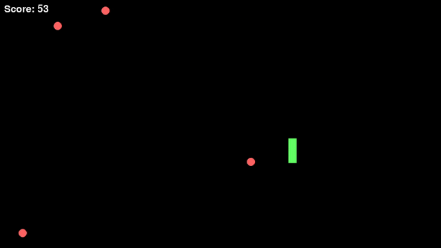

# 🎵 Pitch Dodge

**Pitch Dodge** is a real-time audio-driven Pygame where players dodge musical pitch-based projectiles. Use your keyboard to control the paddle while audio pitch data launches projectiles at you with increasing speed and variety.



---

## 🚀 Features

- 🎧 Audio-reactive gameplay using live pitch data
- 🎮 Real-time keyboard paddle control
- 🔴 Projectiles with randomized directional motion
- ⏱️ Progressive difficulty with increasing speed and spawn rate
- 📈 Scoring system with collision tracking


## 🛠️ Requirements

- Python 3.8+
- [Pygame](https://www.pygame.org/)
- [SoundFile](https://pysoundfile.readthedocs.io/)
- [SoundDevice](https://python-sounddevice.readthedocs.io/)

Install with:

```bash
pip install -r requirements.txt
```

## ▶️ How to Play
Add your .wav audio file to assets/sample.wav or modify the path in game.py.

Run the game:
``` 
python game.py
```

Controls:

⬆️ Arrow key – Move paddle up

⬇️ Arrow key – Move paddle down

❌ Close the window to quit

## 🧠 Gameplay Details
Ball y positions are based on pitch at the current timestamp.

Balls start from the left and move with random upward/downward speed.

Ball speed and spawn rate both increase over time.

Colliding with a ball updates score and resets a brief "grace period."

## 📈 Feature Coverage

| Feature                     | Status     |
|----------------------------|------------|
| Audio pitch parsing        | ✅         |
| Paddle movement            | ✅         |
| Ball collision detection   | ✅         |
| Score updating             | ✅         |
| Randomized ball directions | ✅         |
| Speed scaling over time    | ✅         |
| Spawn rate increase        | ✅         |
| GitHub CI pipeline         | ✅         |
| Unit testing               | 🔄 Planned |
